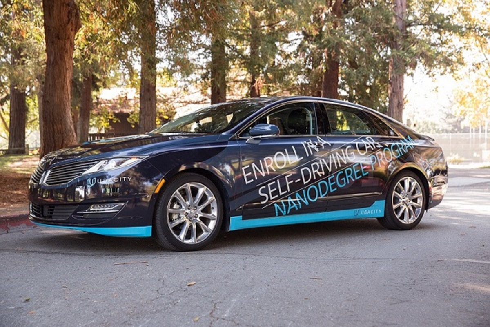
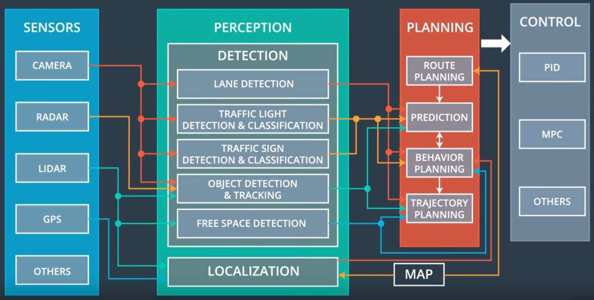
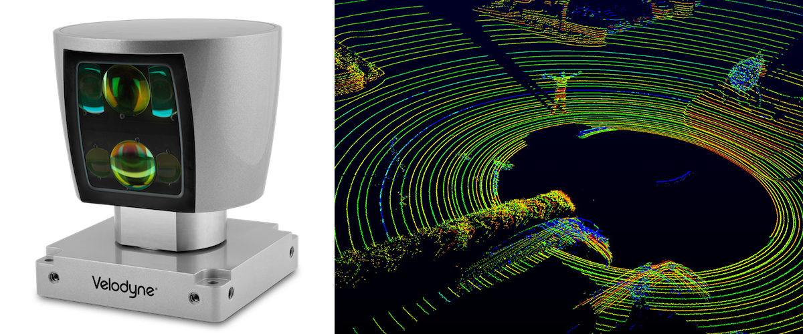

## Project Title: Programming a Real Self-Driving Car
### Team Members: Olaoluwa Popoola, Adrian Chow, Xiaoxuan Chen, Anurag Kumar  and Nikhil Parlapalli

This repository contains a project where we program a self-driving car. This work combines algorithms form computer vision, machine learning with tensor flow, sensor fusion, and vehicle control for implementing intelligence in a car so it can drive itself. The central governing system for control is done using the robot operating system (ROS) which incorporates Dataspeed drive by wire(DBW).


## 1. Introduction
Programming a self driving car involves four major components or subsystems which are sensor subsystem, perception, planning and control. In this project, the car is required to perceive its environment in real time, use the information from perception to determine a 'reasonable' course of action in good time (planning), and carry out the controlled action using actuators.

These subsystems are to be implemeted in Udacity's real self driving car called Carla Figure 1. 

 

***Figure 1: Carla- Udacity's real self driving car used for testing this project*** 

The goal of this project is to enable Carla to drive around a controlled test track using waypoint navigation. The waypoints are ordered set of coordinates that Carla will use to plan its path. While navigating, Carla has to avoid obstacles and obey traffic light. The internal architecture of Carla is presented in Figure 2 showing its major subsystems is presented in Figure 2. 

 

***Figure 2: Carla's Architecture depicting the three subsystems involved in the design of an autonomous car*** 

## 2. Sensor Subsystem
The sensor and perception subsystem could be considered as a unit as shown in Figure 2 or two individual units. However, since the sensor data requires very detailed processing, and sometime sensor fusion, sensor and perception are considered as two subsystems rather than considering them as a unit. The sensor subsystem uses Lidar (Figure 3), Radar, camera and GPS sensors which are mounted on the car to get localization information. 

 

***Figure 3: Lidar sensor and point cloud used to perceive the obstacles and objects in the environment of the autonomous car*** 

## 3. Perception Susbsystem
The perception susbsystem consists of signal proessing software which processes the data from the sensors.  Using the processing carried out by the perception subsystem, sensor data is processed to give meaningful information used by the autonomous vehicle. Most of the vehicle analysis of its environment takes place in the perception subsystem. The perception subsystem consists of two additional subsystems which are localization and detection. The localization subsystem uses the sensor data to determine the precise location of the vehicle. Determining the vehicle location implements outputs of the GPS data and inertial sensors with the vehicle model. The detection system is responsible for understanding the environment. This subsystem include lane detection, traffic sign detection and classification, object detection and tracking, and free space detection. Different parts of the perception subsystem draws data from different parts of the sensor subsystem as shown in Figure 2. 
For this project, the approach to train a feasible model was to perform Transfer Learning on a preexisting MobileNet Classifier from Tensorflow's Object Detection API. Our classifier was modelled after [Alex Lechner](https://github.com/alex-lechner/Traffic-Light-Classification) traffic classifier model. Two models were created using the dataset Alex was provided from Udacity, one for the simulator and one for the real test track.


## 3. Planning Subsystem
The planning subsystem uses the output from perception (processed sensor data), for behavioural planning, short range path planning and long range path planning. This system takes the processed data from the perception subsystem to plan safe paths for the vehicle. The components in this subsystem include route planning, prediction, behaviour planning, and trajectory generation. Route planning is the process with with the vehicle determines the high level path between two points on a map. FOr route planning, the A-star algorithm is used. Prediction is used to identify the maneuver other objects (vehicles/pedestrians) on or around the road might make. Behaviour planning which decides what maneuver our vehicle makes. Trajectory generation plots the precise path the vehicle should follow. In this project, the planning subsystem implements waypoints at 50Hz, which shows the trajectory that the vehicle is to follow.

## 4. Control Subsystem
The control susbsystem sends control commands to the vehicle based on outputs of the path planning system. The control subsystem ensures that the vehicle follows the path specified by the planning subsystem. The control subsystem sends acceleration, braking and steering commands to the vehicle. For this project, proportional integral differential (PID) controllers are used for both throttle control and yaw control (for steering).

## 5. Implementation
Implementation of this subsystems is performed using the robot operating system (ROS). ROS provides the libraries and tools for working with hardware and for passing messages between components. The ROS nodes used for this project include
**Drive-By-Wire Node** which is used  for publish steering, throttle and braking commands to the car, **Waypoint Loader Node**  this node is used to publish the waypoints to the car, **Waypoint Follower Node** used to publish velocity to allow the car to follow the waypoints, **Waypoint Updater Node** which estimages and updates the next set of waypoints, **Trafffic Light Detector Node** to determine the status of any visible traffic light, and the **Dashboard Display Node** which Streams the car's metrics to the terminal.


## 6. Requirements- The installation requirements for testing this program include:

* Ubuntu 16.04 Xenial Xerus or Ubuntu 14.04 Trusty Tahir. [Ubuntu downloads can be found here](https://www.ubuntu.com/download/desktop).
* If using a Virtual Machine to install Ubuntu, use the following configuration as minimum:
  * 2 CPU
  * 2 GB system memory
  * 25 GB of free hard drive space

* Robotic Operating System with the following versions:
  * [ROS Kinetic](http://wiki.ros.org/kinetic/Installation/Ubuntu) if you have Ubuntu 16.04.
  * [ROS Indigo](http://wiki.ros.org/indigo/Installation/Ubuntu) if you have Ubuntu 14.04.
* [Dataspeed DBW](https://bitbucket.org/DataspeedInc/dbw_mkz_ros)
  * Use this option to install the SDK on a workstation that already has ROS installed: [One Line SDK Install (binary)](https://bitbucket.org/DataspeedInc/dbw_mkz_ros/src/81e63fcc335d7b64139d7482017d6a97b405e250/ROS_SETUP.md?fileviewer=file-view-default)
* Download the [Udacity Simulator](https://github.com/udacity/CarND-Capstone/releases).


### Port Forwarding using [uWebSockets](https://github.com/uNetworking/uWebSockets) to set up port forwarding

### Usage
1. Clone the project repository
```bash
git clone https://github.com/orpopoola/Self_Driving_Car

2. Install python dependencies
```bash
cd CarND-Capstone
pip install -r requirements.txt
```
3. Make and run styx
```bash
cd ros
catkin_make
source devel/setup.sh
roslaunch launch/styx.launch
```
4. Run the simulator

### Real world testing
1. Download [training bag](https://s3-us-west-1.amazonaws.com/udacity-selfdrivingcar/traffic_light_bag_file.zip) that was recorded on the Udacity self-driving car.
2. Unzip the file
```bash
unzip traffic_light_bag_file.zip
```
3. Play the bag file
```bash
rosbag play -l traffic_light_bag_file/traffic_light_training.bag
```
4. Launch your project in site mode
```bash
cd CarND-Capstone/ros
roslaunch launch/site.launch
```
5. Confirm that traffic light detection works on real life images

### Other library/driver information
Outside of `requirements.txt`, here is information on other driver/library versions used in the simulator and Carla:

Specific to these libraries, the simulator grader and Carla use the following:

|        | Simulator | Carla  |
| :-----------: |:-------------:| :-----:|
| Nvidia driver | 384.130 | 384.130 |
| CUDA | 8.0.61 | 8.0.61 |
| cuDNN | 6.0.21 | 6.0.21 |
| TensorRT | N/A | N/A |
| OpenCV | 3.2.0-dev | 2.4.8 |
| OpenMP | N/A | N/A |

We are working on a fix to line up the OpenCV versions between the two.


